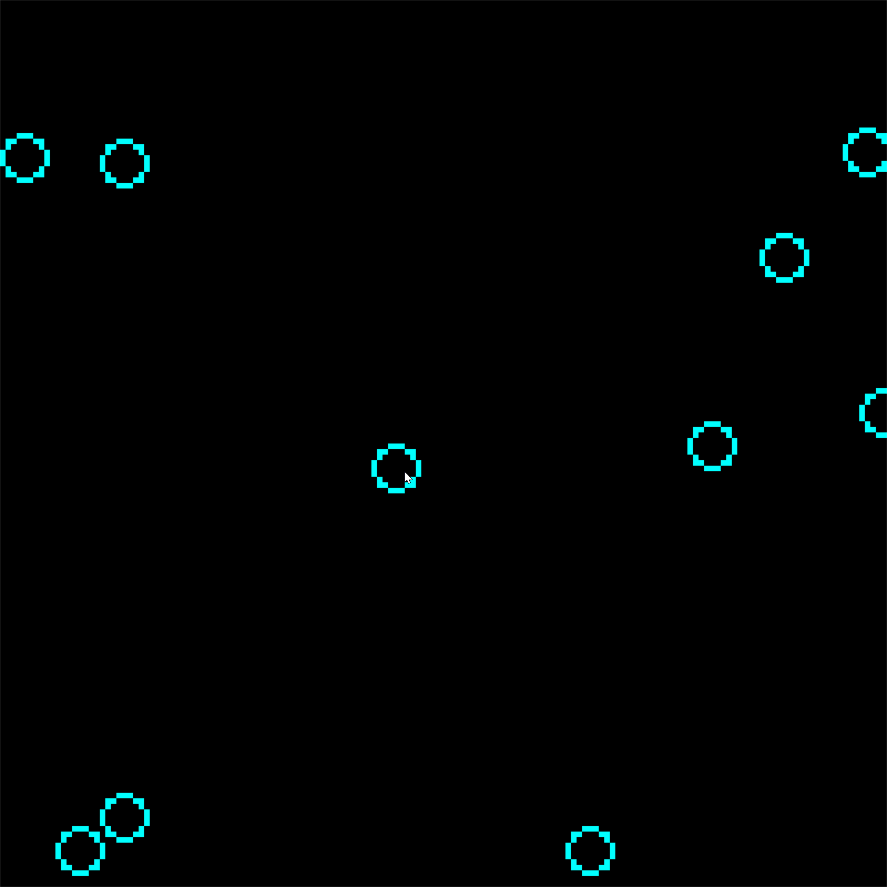

### Checkout branches covering the journey so far

[Main](https://github.com/ldenholm/servmmo/tree/master)
Includes path tracing, static collisions (using olcPixelGameEngine),
AABBs and quad trees.

[Rendering cubes](https://github.com/ldenholm/servmmo/tree/3d_cube)
Switches to OpenGL using GLSL, GLFW, GLM. Explores rendering primitives,
implementing rotation and translation matrices, model view and projection
matrices. This branch forms the basic programmatic structure for the rendering 
engine I will continue to expand.

### Adding acceleration with RMB and drag, only static collisions

