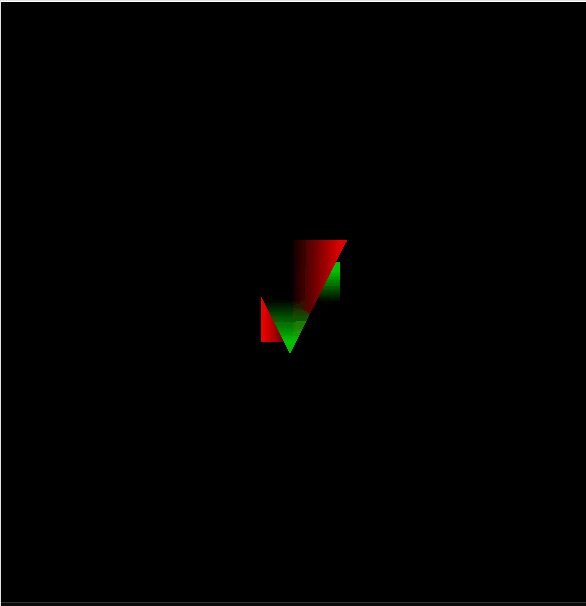

### Drawing a miniature approximate solar system
Implement mini solar system using cubes and pyramid. Added z-axis zooming.
Utilizes matrix stacks for chaining together matrix transformations
and helping with drawing parent heirarchy object trees.

